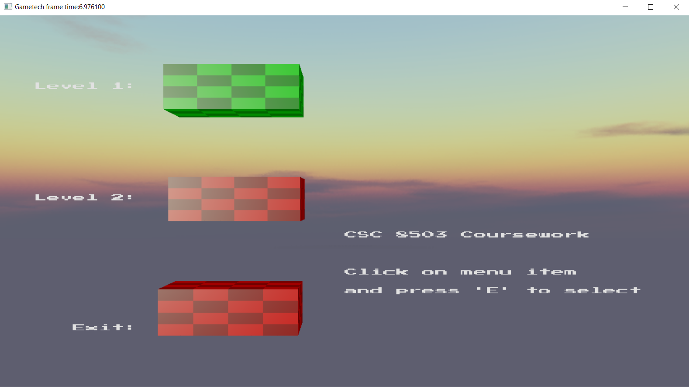
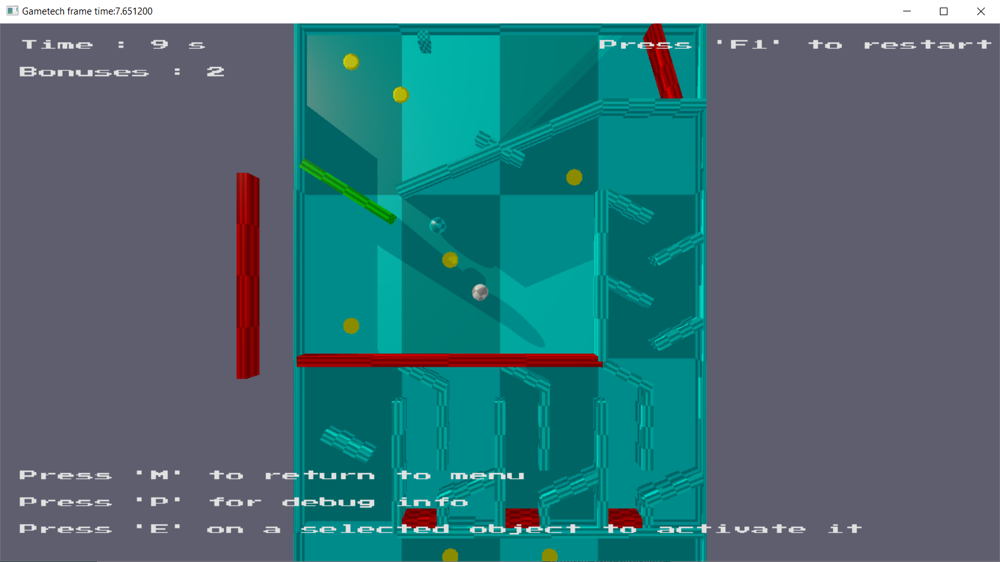
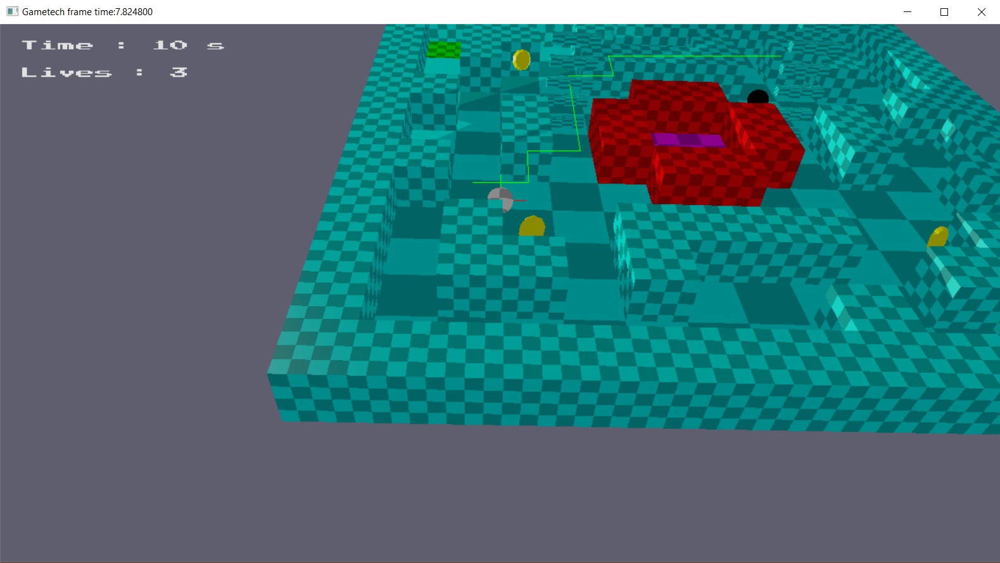
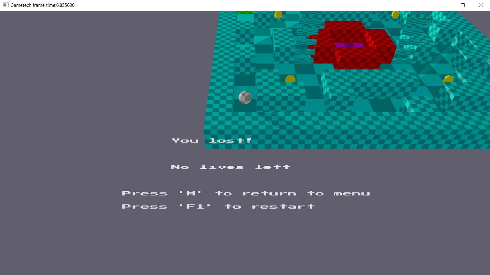

# Advanced-Games-Technologies
Two physics based mini-games created for the advanced games technologies module

Video: https://youtu.be/wI4r2qLIiUE

Game controls:
Menu

Mouse – point and click on menu rectangle to highlight (menu items turn green when selected);
‘E’ – activate selected item menu to start a level, or exit the game.

Level 1

Mouse – point and click on interactable tiles (colored red, or moving obstacles) to select them (turn green when selected);
‘E’ – activate/deactivate selected tile;
‘P’ – activate/deactivate debug info. Prints selected tile info on screen.

Level 2

Arrow keys – tilt the floor;
‘P’ key and Mouse controls for debug info not included for ease of player control.

General

‘F1’ – restart the current level;
‘M’ – return to main menu from any level;
‘ESC’ – close the game.
How to play:

In both levels your objective is to reach the goal which is a magenta platform. In level 1 you must move your ball by activating the red platforms that perform different actions such as rotate or move in some direction. In level two, you move the ball by tilting the floor. You must collect the 3 unlock pads (green platforms in each corner of the level) to unlock your way to the goal whilst avoiding the enemy ball.

Main menu which uses position constraints to create a ‘rope ladder’ from the menu items. Inspired by the menu in the game Sumotori Dreams.

An image of the first level, including the UI that shows the time and bonuses collected, as well as some controls.

An image of the second level showing the maze, bonuses, unlock pads (green), the enemy (black sphere) and the navigation path drawn with the green line.

Example of the loss screen.

Implemented Features Descriptions

**Player Movement:**

•	Player can move: Player ball can moves in both levels;

•	Player can rotate: Player ball rotates with the use of friction;

•	Player uses forces/impulses for movement: Yes – ImpulseResolveCollision() in PhysicsSystem.cpp;

•	Player uses torque/impulses for rotation: Yes – ImpulseResolveCollision() in PhysicsSystem.cpp;

**AABB and Sphere Collisions:**

•	Sphere/Sphere: Implemented – SphereIntersection() in CollisionDetection.cpp;

•	Sphere/AABB: Implemented – AABBSphereIntersection() in CollisionDetection.cpp;

•	AABB/AABB: Implemented – AABBIntersection() in CollisionDetection.cpp;

**Basic Extra Collisions:** 

•	Something vs Plane: Ray/Plane Intersections implemented in RayBoxIntersection() in CollisionDetection.cpp;

•	OBB vs Sphere: Implemented – OBBSphereIntersection() in CollisionDetection.cpp;

•	Raycast vs world for debug info: All raycast intersection types implemented in CollisionDetection.cpp, debug info drawing on screen implemented in DrawDebugInfo() in CourseworkGame.cpp;

**Collision Resolution:**

•	Projection method used: Yes – ImpulseResolveCollision() in PhysicsSystem.cpp;

•	Impulse method used: Yes – ImpulseResolveCollision() in PhysicsSystem.cpp;

•	Multiple coefficients of restitution: Yes, two coefficients of restitution used in linear and friction impulse calculations - ImpulseResolveCollision() in PhysicsSystem.cpp;

•	Penalty method used somewhere: Spring separation added in ImpulseResolveCollision() in PhysicsSystem.cpp, also is used in Level 1 to make attach a sphere to the player ball as an obstacle – AttachSpringTo() and UpdateSprings() in GameObject.cpp;

**Stateful Behaviour: 

•	Simple menu implemented: Yes, CreateMenu() and DrawMenu() in CourseworkGame.cpp;

•	Stateful obstacles in level: Yes, spinning, moving FSM AI added to both levels – EnemyBallAI.cpp, SpinningGameObject.cpp, StateGameObject.cpp in CSC8503Common

•	Multiple different obstacle types: Yes, obstacles include spinning, moving platforms, state-based enemy ball, and a spring-attached sphere.

Gameplay Effects: 

•	Player can collect bonuses: Yes, player can collect bonuses in both levels;

•	Player can win game: Yes, player can win game by reaching the goal in both levels;

•	Player can lose game: Yes, the player can lose by either reaching time limit or losing all lives;

•	Player shown final score: Yes, time taken to complete level and collected bonuses printed on screen;

•	Simple menu implemented: Yes, player is shown the menu upon launching the game. Additional info prompting the player to either return to menu or restart the level appear when losing or winning a level;

Advanced AI:

•	AI Opponent present: Yes, level 2 features an enemy ball – EnemyBallAI.cpp in CSC8503Common;

•	State-based opponent AI: Yes, the AI has two states – chase player or grab  bonus;

•	AI can collect bonuses: Yes, the AI will collect bonuses to freeze the player;

•	AI can try to avoid an obstacle: Yes, the AI will avoid walls. NavigationGrid.cpp has additional features implemented to allow for objects of different types to be added/removed from the grid in real-time. The pathfinding algorithm can find new paths if obstacles are added, moved, or removed like in the case when player collects 3 unlock pads in level 2 and some of the walls are removed, thus allowing the AI to traverse previously blocked tiles;

•	AI can teleport/respawn if necessary: The AI will respawn in its original starting position if the player is caught or the level is restarted;

Pathfinding: 

•	Grid-based pathfinding demonstrated: Level 2 is designed using grid tiles. The AI pathfinding uses the grid to traverse the level. NavigationGrid.cpp has a function UpdateGrid() to print the real-time grid to console that shows positions of the walls, enemy and player. This function is called (will be commented out upon submission) in UpdateGame() in CourseworkGame.cpp; 

•	AI uses pathfinding: Yes, the AI uses the A* algorithm to traverse the level – FindPath() in NavigationGrid.cpp;	

•	AI can follow path: Yes, the AI will follow the found path – followPlayer() and moveToBonus() in EnemyBallAI.cpp. Both functions have code that draws the path (will be commented out on submission);

Constraints: 

•	Position constraint demonstrated: Yes, demonstrated in the menu, as well as level 2 where some obstacles use position constraints;

•	An obstacle uses constraints: Yes, same as previous point;

Advanced Collision Resolution: 

•	Penalty method used somewhere: Penalty method used only in level 1 with the sphere that follows the player; couldn’t figure out where to use it in level 2;

•	Friction applied during resolution: Yes - ImpulseResolveCollision() in PhysicsSystem.cpp;

Advanced Collision Detection:

•	Capsule vs Sphere: Yes – CapsuleSphereIntersection() in CollisionDetection.cpp;

•	Capsule vs AABB/OBB: Yes – CapsuleOBBIntersection() and CapsuleAABBIntersection() in CollisionDetection.cpp. Implemented and tested (it’s not perfect but works - half marks maybe?), however never really used.

•	Spatial Acceleration Structures used: Yes, QuadTree implemented from tutorial notes and used for level 1 - QuadTree.h. Switched to basic collision detection for level 2 because it gave better performance (Try pressing ‘B’ to switch to quad trees in level 2);

Advanced Menu: 

•	User can select different game types: Yes, using the main menu;
